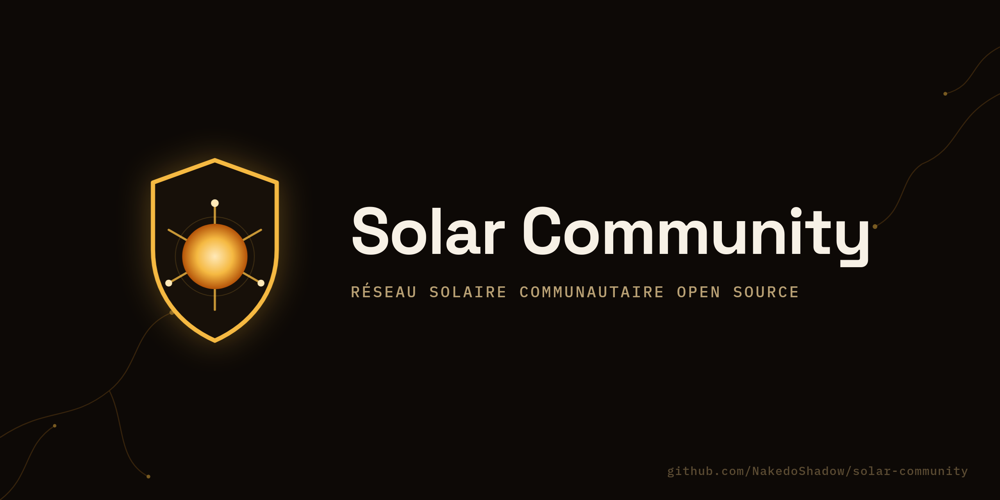

*[English version](README.en.md)*

# Solar Community

> Un framework open source pour concevoir, dimensionner et superviser des micro-réseaux solaires communautaires — sans dépendre des fournisseurs d'énergie centralisés.

📄 [Livre blanc](WHITEPAPER.md) · 🗺️ [Feuille de route](ROADMAP.md) · 🤝 [Contribuer](CONTRIBUTING.md) · 🛡️ [Sécurité (code)](SECURITY.md) · ⚡ [Sécurité électrique](docs/safety/README.md) · 💬 [Code de conduite](CODE_OF_CONDUCT.md)

## Origine

Solar Community est né comme une graine dans le [Dream Memory](https://nakedo.wordpress.com/2026/08/24/eclairer-lavenir-deployer-un-reseau-solaire-communautaire-open-source/) d'[ADA](https://nakedo.wordpress.com/) le 24 août 2026, juste après [BioSentinel](https://github.com/NakedoShadow/biosentinel). L'intention d'origine décrit même un premier pilote déployé dans un village fictif ("Saint-Loup-sur-Mér") avec des chiffres précis de réduction d'énergie et de CO₂ — **ce pilote n'existe pas**. C'est une vision projetée par le Dream Memory, pas un déploiement réel. Ce dépôt reprend cette vision comme point de départ, pas comme un résultat acquis (voir la [feuille de route](ROADMAP.md) pour ce qui est réellement prévu, et à quel horizon).

**Statut actuel : bootstrap.** Rien n'est encore déployé sur le terrain.

## Pourquoi open source, et pourquoi MIT (pas GPL comme BioSentinel)

Même refus de toute dépendance propriétaire qu'ailleurs chez ADA : le code, les schémas et les protocoles sont publics dès le premier commit, sans barrière financière pour auditer, adapter ou redéployer. La licence choisie ici est **MIT**, volontairement plus permissive que le GPL-v3 de BioSentinel : un framework de dimensionnement et de supervision énergétique a plus de chances de se répandre vite s'il peut être intégré tel quel par des installateurs, des coopératives ou des fabricants de matériel — y compris dans des produits qu'ils commercialisent — sans obligation de reverser leurs propres ajouts. La transparence du cœur du projet reste garantie ; ce qui change, c'est qu'on ne force personne à ouvrir ce qu'il construit par-dessus.

## Contrainte de conception non négociable : la sécurité électrique avant tout

**Ce dépôt ne publiera aucun guide poussant quelqu'un à bricoler seul une installation électrique.** Le firmware de supervision (mesure de production, de charge batterie, d'état onduleur) est dans le périmètre du projet ; l'installation physique des panneaux, du câblage et des onduleurs ne l'est pas tant que le cadre de sécurité n'est pas posé et validé. Détails et statut : [docs/safety/](docs/safety/README.md).

## Architecture visée

| Pilier | Techno | Rôle |
|---|---|---|
| **Firmware de supervision** (`firmware/`) | Arduino-compatible | Lecture production/batterie/onduleur — pas de guide d'installation |
| **Génération de BOM** (`bom/`) | Scripts / données ouvertes | Listes de composants adaptées à un budget (`sho-kitbuilder`) |
| **Cartographie de sites** (`siting/`) | Imagerie Sentinel-2 (libre) | Évaluation de l'ensoleillement et de l'impact d'un site (`sho-fieldmapper`) |
| **Plateforme de données** (`backend/`) | Node.js + MQTT + TimescaleDB | Ingestion des mesures, équilibrage de charge (`sho-balancer`) |
| **Dashboard** (`dashboard/`) | React + D3.js | Visualisation personnalisable par chaque communauté |

## Les opérateurs SHO

Comme pour BioSentinel, le développement est orchestré par des **Shadow Hermes Operators** — profils Hermes isolés en Bot Mode, un rôle chacun. Détails : [docs/sho-operators/README.md](docs/sho-operators/README.md).

| Opérateur | Rôle |
|---|---|
| `sho-kitbuilder` | Génère les BOM (listes de composants) adaptées à chaque budget |
| `sho-fieldmapper` | Identifie les emplacements optimaux via imagerie satellite libre |
| `sho-trainer` | Tutoriels et ateliers — usage du logiciel, pas d'installation électrique |
| `sho-balancer` | Équilibrage de charge entre nœuds via MQTT |
| `sho-safeguard` | Garde-fou sécurité électrique et réglementaire — droit de veto, comme `sho-dataguard` chez BioSentinel |

## Contribuer

Process complet, format des propositions, et la règle de revue sécurité : [CONTRIBUTING.md](CONTRIBUTING.md).

## Licence

[MIT](LICENSE)
